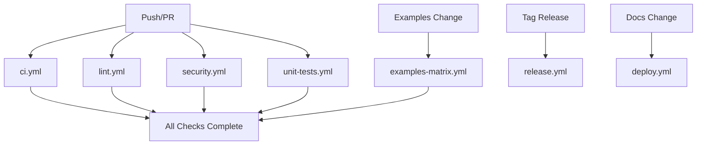

# CI/CD Workflows

This section describes the GitHub Actions workflows used for continuous integration and deployment in the gRPC Testify project.

## 📋 Workflow Overview

### Core Workflows

#### 🔄 `ci.yml` - Main CI/CD Pipeline
- **Purpose**: Project validation and coordination
- **Triggers**: Push to master/v1-dev, PRs, releases
- **Jobs**:
  - Project structure validation
  - Basic functionality testing
  - Examples configuration validation
  - Workflow information display

#### 📊 `examples-matrix.yml` - Examples Matrix Testing
- **Purpose**: Comprehensive testing of all gRPC examples
- **Triggers**: Changes to examples/, manual dispatch
- **Features**:
  - Dynamic matrix generation from `examples/examples-config.json`
  - Parallel testing of all examples
  - Real gRPC server testing
  - Comprehensive validation

### Specialized Workflows

#### 🔍 `lint.yml` - Code Quality & Linting
- **Purpose**: Code quality checks and linting
- **Triggers**: Push/PR to master/v1-dev
- **Features**:
  - ShellCheck for bash scripts
  - Markdownlint for documentation
  - JSON/YAML validation
  - Code formatting verification

#### 🔒 `security.yml` - Security Scanning
- **Purpose**: Security vulnerability detection
- **Triggers**: Push/PR, daily schedule (2 AM UTC)
- **Features**:
  - CodeQL analysis
  - Dependency vulnerability scanning
  - SARIF report generation
  - Security advisory integration

#### 🧪 `unit-tests.yml` - Unit Testing
- **Purpose**: BATS unit test execution
- **Triggers**: Push/PR to master/v1-dev
- **Features**:
  - Cross-platform testing (Ubuntu, macOS)
  - BATS test framework
  - Parallel test execution
  - Coverage reporting

#### 🏷️ `release.yml` - Release Management & Checksums  
- **Purpose**: Comprehensive release process with integrity validation
- **Triggers**: Tagged releases (v*)
- **Features**:
  - Automated script generation
  - SHA256 checksum generation and validation
  - Homebrew formula updates
  - Automated release notes
  - Asset upload with integrity verification
  - Version validation
  - Distribution management

#### 🚀 `deploy.yml` - Documentation Deployment
- **Purpose**: VitePress documentation deployment
- **Features**:
  - Automatic deployment to GitHub Pages
  - Link validation
  - Build artifact management

## 🔧 Configuration

### Go Version
All workflows use **Go 1.25** for consistency across the project.

### Platform Support
- **Ubuntu Latest**: Primary platform for all workflows
- **macOS 14 (Apple Silicon)**: Secondary platform for compatibility
- **macOS Latest (Intel)**: Legacy macOS support

### Triggers

| Workflow | Push | PR | Schedule | Manual |
|----------|------|----|---------:|--------|
| ci.yml | ✅ | ✅ | ❌ | ✅ |
| examples-matrix.yml | examples/ | examples/ | ❌ | ✅ |
| lint.yml | ✅ | ✅ | ❌ | ✅ |
| security.yml | ✅ | ✅ | Daily 2AM | ✅ |
| unit-tests.yml | ✅ | ✅ | ❌ | ✅ |
| deploy.yml | master docs/ | ❌ | ❌ | ✅ |

## 📊 Examples Matrix

The examples matrix is dynamically generated from `examples/examples-config.json`:

```json
{
  "groups": {
    "basic-examples": {
      "description": "Basic gRPC examples with unary and server streaming",
      "examples": [
        {
          "name": "user-management",
          "port": 50051,
          "description": "User management system with unary RPC",
          "features": ["unary", "tls"],
          "test_count": 8
        }
        // ... more examples
      ]
    }
    // ... more groups
  }
}
```

### Adding New Examples

1. Create example directory: `examples/group-name/your-example/`
2. Add server implementation with proper proto files
3. Create test files in `tests/` subdirectory
4. Update `examples/examples-config.json` with example metadata
5. Ensure unique port assignment (50051-50058 range)

## 🚦 Workflow Dependencies



## 📈 Metrics and Reporting

### Artifacts Generated
- Test results and coverage reports
- Build artifacts and binaries
- Security scan reports
- Documentation builds

### Summary Reports
Each workflow generates GitHub Step Summary reports with:
- ✅ Success indicators
- ❌ Failure details
- 📊 Statistics and metrics
- 🔗 Links to related resources

## 📝 Development Guidelines

### Workflow Updates
1. Test changes in a fork first
2. Use `workflow_dispatch` for manual testing
3. Validate YAML syntax before committing
4. Update documentation when adding workflows

### Best Practices
- Use descriptive job and step names
- Include emojis for visual clarity
- Add comprehensive error handling
- Generate detailed summary reports
- Cache dependencies when possible

### Security Considerations
- No secrets in workflow files
- Use GitHub Secrets for sensitive data
- Regular security scanning
- Minimal permissions principle

## 🔧 Troubleshooting

### Common Issues

#### Matrix Generation Failure
- Verify `examples/examples-config.json` syntax
- Check that all examples have required fields
- Ensure proper group structure

#### Test Failures
- Check server startup logs
- Verify port availability
- Review test file syntax (.gctf)

#### Build Issues
- Confirm Go version compatibility
- Check dependency versions
- Verify platform-specific requirements

For more information about GitHub Actions, see the [official documentation](https://docs.github.com/en/actions).
